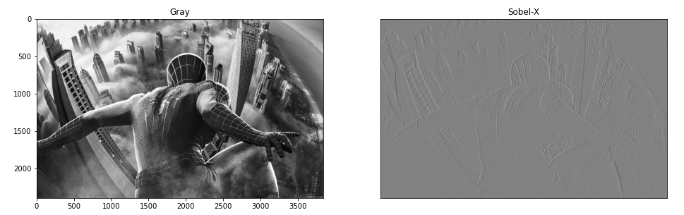
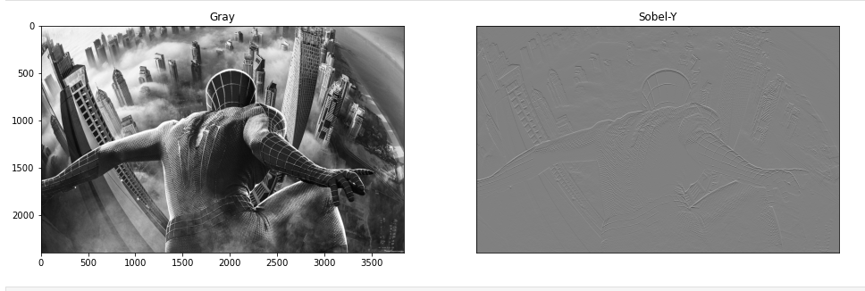
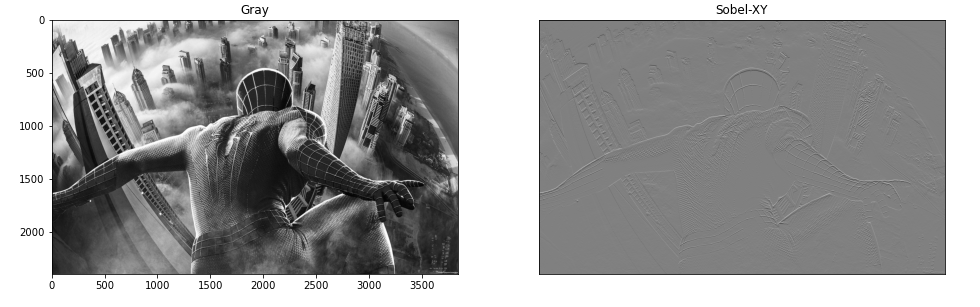
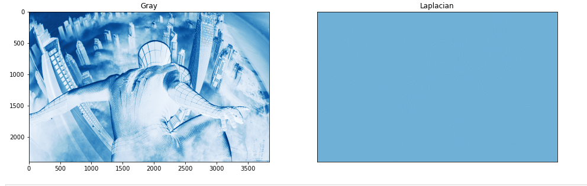
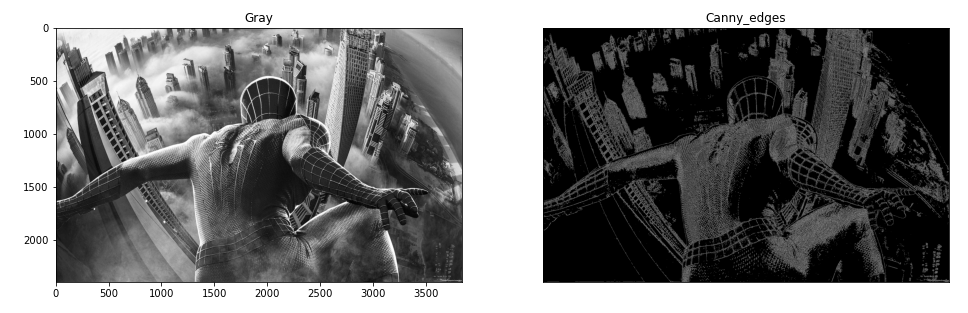

# Edge-Detection
## Aim:
To perform edge detection using Sobel, Laplacian, and Canny edge detectors.

## Software Required:
Anaconda - Python 3.7

## Algorithm:
### Step1: Import the required packages for further process.
<br>


### Step2: Read the image and convert the bgr image to gray scale image.
<br>

### Step3: Use any filters for smoothing the image to reduse the noise.
<br>

### Step4: Apply the respective filters -Sobel,Laplacian edge dectector and Canny edge dector.
<br>

### Step5: Display the filtered image using plot and imshow.
<br>

 
## Program:

``` Python

# SOBEL EDGE DETECTOR
## SOBEL X:
import cv2
import matplotlib.pyplot as plt
image=cv2.imread("spidy.jpg")
gray_img=cv2.cvtColor(image,cv2.COLOR_BGR2GRAY)
img=cv2.GaussianBlur(gray_img,(3,3),0)
sobelx=cv2.Sobel(img,cv2.CV_64F,1,0,ksize=5)
plt.figure(figsize=(16,16))
plt.subplot(1,2,1)
plt.imshow(img,cmap='gray')
plt.title('Gray')
plt.subplot(1,2,2)
plt.imshow(sobelx,cmap='gray')
plt.title("Sobel-X")
plt.xticks([])
plt.yticks([])
plt.show()

## SOBEL Y:
import cv2
import matplotlib.pyplot as plt
image=cv2.imread("spidy.jpg")
gray_img=cv2.cvtColor(image,cv2.COLOR_BGR2GRAY)
img=cv2.GaussianBlur(gray_img,(3,3),0)
sobely=cv2.Sobel(img,cv2.CV_64F,0,1,ksize=5)
plt.figure(figsize=(16,16))
plt.subplot(1,2,1)
plt.imshow(img,cmap='gray')
plt.title('Gray')
plt.subplot(1,2,2)
plt.imshow(sobely,cmap='gray')
plt.title("Sobel-Y")
plt.xticks([])
plt.yticks([])
plt.show()

## SOBEL XY:
import cv2
import matplotlib.pyplot as plt
image=cv2.imread("spidy.jpg")
gray_img=cv2.cvtColor(image,cv2.COLOR_BGR2GRAY)
img=cv2.GaussianBlur(gray_img,(3,3),0)
sobelxy=cv2.Sobel(img,cv2.CV_64F,0,1,ksize=5)
plt.figure(figsize=(16,16))
plt.subplot(1,2,1)
plt.imshow(img,cmap='gray')
plt.title('Gray')
plt.subplot(1,2,2)
plt.imshow(sobelxy,cmap='gray')
plt.title("Sobel-XY")
plt.xticks([])
plt.yticks([])
plt.show()


# LAPLACIAN EDGE DETECTOR:
import cv2
import matplotlib.pyplot as plt
image=cv2.imread("spidy.jpg")
gray_img=cv2.cvtColor(image,cv2.COLOR_BGR2GRAY)
img=cv2.GaussianBlur(gray_img,(3,3),0)
laplacian = cv2.Laplacian(img,cv2.CV_64F)
plt.figure(figsize=(16,16))
plt.subplot(1,2,1)
plt.imshow(img,cmap='Blues')
plt.title('Gray')
plt.subplot(1,2,2)
plt.imshow(laplacian,cmap='Blues')
plt.title("Laplacian")
plt.xticks([])
plt.yticks([])
plt.show()


# CANNY EDGE DETECTOR:
import cv2
import matplotlib.pyplot as plt
image=cv2.imread("spidy.jpg")
gray_img=cv2.cvtColor(image,cv2.COLOR_BGR2GRAY)
img=cv2.GaussianBlur(gray_img,(3,3),0)
canny_edges = cv2.Canny(image, 120, 150)
plt.figure(figsize=(16,16))
plt.subplot(1,2,1)
plt.imshow(img,cmap='gray')
plt.title('Gray')
plt.subplot(1,2,2)
plt.imshow(canny_edges,cmap='gray')
plt.title("Canny_edges")
plt.xticks([])
plt.yticks([])
plt.show()


```
## Output:
### SOBEL EDGE DETECTOR
# SOBEL X:

<br>
<br>

## SOBEL Y:

<br>
<br>

## SOBEL XY:

<br>
<br>


### LAPLACIAN EDGE DETECTOR
<br>
<br>


<br>
<br>


### CANNY EDGE DETECTOR
<br>
<br>


<br>
<br>


## Result:
Thus the edges are detected using Sobel, Laplacian, and Canny edge detectors.
